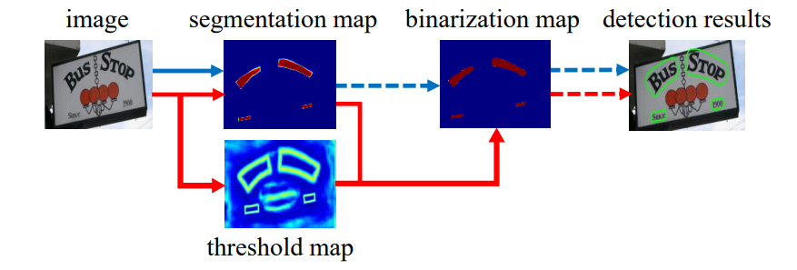

# Differentiable Binarisation meets Graph Neural Networks

Introduced by Liao et. al in the architecture of [DBNet](https://arxiv.org/abs/1911.08947) and then extended by the same authors in [DBNet++](https://arxiv.org/pdf/2202.10304.pdf), Differentiable Binarisation (DB) proved itself to be a powerful and time efficient tool for binarising the output of a neural network. Originally applied to the task of "in-the-wild" text detection, where the binarisation of the output is a crucial and non-trivial step, the technique provided a way for neural networks to learn the binarisation process by themselves, without the need of manually-set post-processing steps. It increased the accuracy of classification of the pixels around the border of text instances, leading not only to a better detection, but also to a better segmentation.

Given the main goal of introducing DB was to support classification of the pixels close to the borders of text instances, it is natural to think that this technique could be applied to other tasks where the point belonging to one class lie in compact clusters, and the points on the boundaries can lead to misclassification. This potentially can be the case in the task of node classification in graph neural networks (GNNs), where the nodes belonging to one class are often grouped together in the graph. This repository implements the DB module in the context of GNNs, and checks whether it can improve the performance of several GNN architectures across multpile binary node classification datasets.

## Differentiable Binarisation

In the paper [DBNet](https://arxiv.org/abs/1911.08947), the authors propose a differentiable binarisation module that can be inserted in any neural network trained for binary classification problem. The original architecture of DBNet consists of three main components:
- backbone network (e.g. ResNet-50) used to extract features from the input image
- probability head, producing a segmentation map
- thresholding head, predicting the boundaries of text regions, i.e. the areas whose pixels should be strongly binarised

To obtain the final binarised output, each pixel is transformed according to the DB formula:

$\hat{B}_{i,j} = \frac{1}{1+e^{-k(P_{i,j}-T_{i,j})}}$

where $P$ represents the segmetation map, $T$ - the thresholding map, and $k$ is a temperature constant, set by the authors to 50. This allows the network to learn the binarisation process on its own, without the need of manually setting the thresholding value, making the whole process differentiable and end-to-end trainable.

In the experiments, the same architecture is adapted to the GNN scenario: for a given backbone network and classification head, we study the effect of adding the DB module to the network.

## Datasets

The experiments are performed on the following real datasets:
- [Pubmed](https://pytorch-geometric.readthedocs.io/en/latest/generated/torch_geometric.datasets.CitationFull.html#torch_geometric.datasets.CitationFull)
- [Github](https://pytorch-geometric.readthedocs.io/en/latest/generated/torch_geometric.datasets.GitHub.html#torch_geometric.datasets.GitHub)
- [EllipticBitcoinDataset](https://pytorch-geometric.readthedocs.io/en/latest/generated/torch_geometric.datasets.EllipticBitcoinDataset.html#torch_geometric.datasets.EllipticBitcoinDataset)
- [Twitch-DE](https://pytorch-geometric.readthedocs.io/en/latest/generated/torch_geometric.datasets.Twitch.html#torch_geometric.datasets.Twitch)

and two artificial datasets:

#### Water Distribution Dataset (WDD)

The dataset consists of artificially generated graphs, where nodes represent distribution points and edges represent pipes. Each node has a set of features, being a 1-hot encoding of the strength of the source of water at that point. We assume that source of water $v$ distributes water to all points located in a radius of $k_v$, where $k_v$ is the strength of source $v$.

The targets are binary labels, where a label of 1 means that the node is a tap, and a label of 0 means that the node is not a tap (no water is distributed to that point).

#### Signal Distribution Dataset (SDD)

The dataset consists of artificially generated graphs, where nodes represent distribution points and edges represent connections. Each node has a set of features, being a 1-hot encoding of the strength of the source of signal / distractor at that point. We assume that source of signal $v$ distributes signal to all points located in a radius of $k_v$, where $k_v$ is the strength of source $v$, with the strenth decreasing by 1 as the distance from the source increases by 1. Analogously, the distractors affect points lying in at most $|k_v|$ distance from the distractor, where $k_v$ is the strength of the distractor.

The targets are binary labels, where a label of 1 means that there is a signal at the point (the cumulative power of signal sources at that exceeds the strength of distraction at that point).

## Results

SDDataset, CNN 5 layers, 32 hidden_dim:
Mean accuracy:  90.90979385375977
Standard deviation:  0.3178049320139572

### Island Dataset

| Model | Accuracy | Precision | Recall | F1 |
| --- | :---: | :---: | :---: | :-----: |
| DBCNN 	|   99.81 ± 0.16 	|	98.99 ± 0.92	|	99.61 ± 0.23	|	99.30 ± 0.56	|

