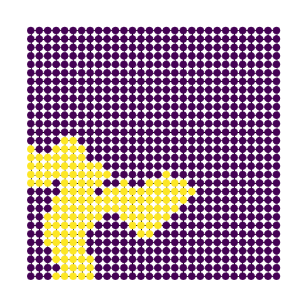
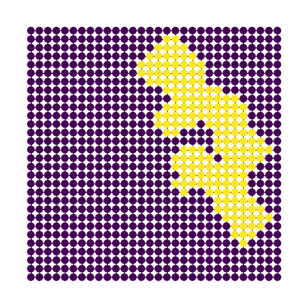
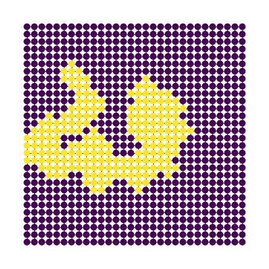
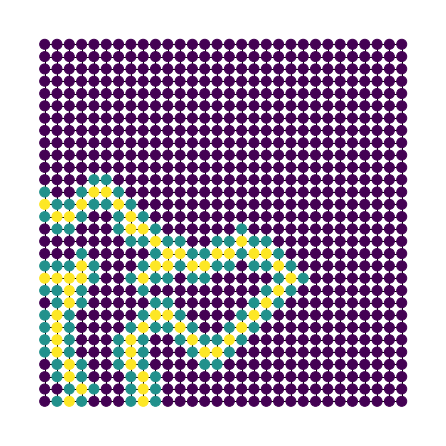
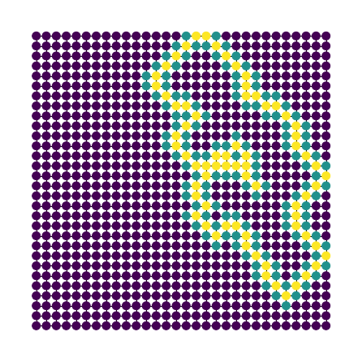
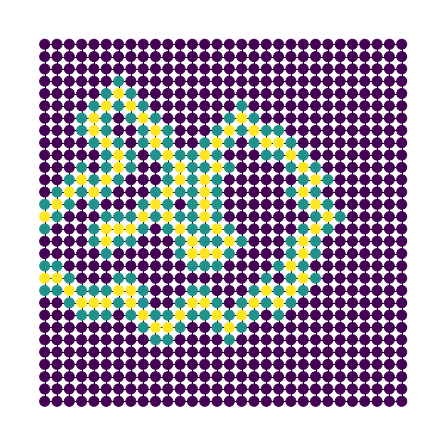

# Island Dataset

The dataset consists of artificially generated orthogonal grid graphs representing islands. Each node has a set of features, which are positive if the node represents land and negative if the node represents water. The targets are binary labels, where a label of 1 means that the node either represents a land area or is directly connected to a land node, and a label of 0 represents a water node not connected to any land area. 

## Dataset generation

The dataset used for evaluations contains 1000 graphs, each of size 30x30. The graphs are generated using the following procedure:
- randomly choose a node to be the starting node
- randomly choose the length of the random walk performed to generate the island
- for the chosen number of steps, randomly choose a cell connected by an edge to the current cell and move to it
- mark all cells visited during the walk as land cells

The examples of generated islands are shown below:

## Thresholding map

The thresholding maps used by the DB module are generated using the standard procedure:
- set the thresholding value of each 0-class node connected by an edge to a 1-class node to 1
- set the thresholding value of each unassigned node connected to a node with a thresholding value of 1 to 0.5

Examples of thresholding maps for the islands shown above are presented below:

## Results

The results of the experiments are presented in the table below:

| Model | Accuracy | Precision | Recall | F1 |
| --- | :---: | :---: | :---: | :-----: |
| GCN		|	99.77 ± 0.14	|	98.99 ± 0.70	|	99.33 ± 0.39	|	99.16 ± 0.51	|
| DB-GCN	|	99.89 ± 0.09	|	99.59 ± 0.54	|	99.63 ± 0.29	|	99.61 ± 0.31	|
| DB-GCN+SV |   99.80 ± 0.09 	|	99.08 ± 0.62	|	99.50 ± 0.17	|	99.29 ± 0.32	|
